<a href="https://khalidkhnz.in"></a>

<a href="https://khalidkhnz.in"></a>

<a href="https://khalidkhnz.in"></a>

  <a href="https://khalidkhnz.in"></a>
  <a href="https://github.com/khalidkhnz/context-man"></a>
  <a href="https://khalidkhnz.in"></a>
  <a href="https://khalidkhnz.in"></a>
  <a href="https://khalidkhnz.in"></a>
  <a href="https://khalidkhnz.in"></a>
  <a href="https://github.com/khalidkhnz/windows11-inspired-dashboard"></a>
  <a href="https://github.com/khalidkhnz/custom-hyper"></a>

<picture>
  <source media="(prefers-color-scheme: dark)" srcset="https://raw.githubusercontent.com/khalidkhnz/khalidkhnz/output/github-snake-dark.svg">
  
</picture>

<a href="mailto:eternalkhalidkhnz@gmail.com"></a>

  
  
  
  

